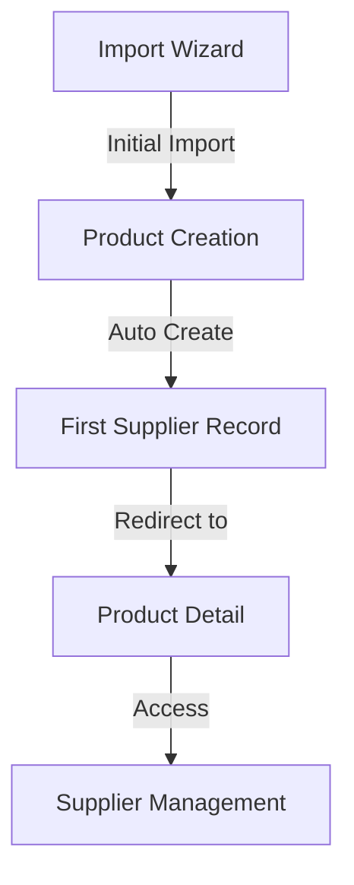

# Product Import V2 - Supplier Management Update

## Recent Additions: Supplier Management

### Overview
Added multi-supplier support to allow products to be:
- Imported from multiple suppliers (e.g., Home Depot, Lowes)
- Manually added from other suppliers
- Tracked with supplier-specific details (price, URL, etc.)

### Implementation Details

#### Database Schema
```prisma
model ProductSupplier {
  id          String   @id @default(cuid())
  productId   String
  product     Product  @relation(fields: [productId], references: [id])
  name        String   // e.g., "Home Depot", "Lowes", "Amazon"
  externalId  String?  // Only for suppliers we import from
  price       Decimal?
  url         String?  // Link to product on supplier site
  isImported  Boolean  @default(false) // Whether we import from this supplier
  createdAt   DateTime @default(now())
  updatedAt   DateTime @updatedAt

  @@unique([productId, name])
}
```

#### New Components
1. Supplier Management Page (`/admin/products/[id]/suppliers`)
   - List existing suppliers
   - Add new suppliers
   - Remove suppliers
   - View supplier details

2. Add Supplier Modal
   - Supplier name
   - Price tracking
   - External URL
   - Import status
   - External ID for imported products

### Current Status

#### Completed
- [x] Basic supplier management UI
- [x] Add/remove suppliers
- [x] Price tracking
- [x] URL management
- [x] Import source tracking

#### In Progress
- [ ] Price history tracking
- [ ] Stock status monitoring
- [ ] Supplier comparison
- [ ] Best price tracking

### Integration with Import System

#### During Import
1. Initial supplier data captured from import source
2. Supplier marked as import source
3. External ID and URL preserved

#### Post-Import
1. Additional suppliers can be added
2. Prices can be updated
3. URLs can be added/updated
4. Import status tracked per supplier

### Next Steps

1. Price Monitoring
   - Track price changes
   - Store price history
   - Alert on significant changes

2. Stock Monitoring
   - Track availability
   - Alert on stock changes
   - Monitor across suppliers

3. Supplier Comparison
   - Compare prices
   - Compare availability
   - Track shipping options

4. Data Management
   - Price history cleanup
   - Data archiving
   - Performance optimization

### Technical Implementation Notes

#### API Routes
- GET: Fetch suppliers for a product
- POST: Add new supplier
- DELETE: Remove supplier
- (Planned) PUT: Update supplier details
- (Planned) GET: Price history

#### State Management
- Local state for UI
- API calls for persistence
- Optimistic updates for better UX

#### Type Safety
- Strong typing throughout
- Validation on both client and server
- Clear error handling

### Future Considerations

1. Automated Price Updates
   - API integration with suppliers
   - Scheduled price checks
   - Automated best price selection

2. Enhanced Supplier Management
   - Supplier categories
   - Preferred suppliers
   - Supplier performance tracking

3. Data Analysis
   - Price trends
   - Availability patterns
   - Supplier reliability metrics

### Related Documentation
- product-import-v2.md (main documentation)
- product-system-documentation.md (system overview)
- api-documentation.md (API endpoints)

## Current Work Context (Last Updated)

### Active Issues
Currently working on TypeScript errors in route.ts:
```typescript
Object literal may only specify known properties, and 'productSuppliers' does not exist in type 'ProductInclude<DefaultArgs>'
```

### Current Files Being Modified
1. src/app/api/products/[id]/suppliers/route.ts
   - Implementing supplier API endpoints
   - Fixing Prisma type issues
   - Current approach: trying select vs include

2. src/app/admin/products/[id]/suppliers/page.tsx
   - Supplier management UI
   - Recently added error handling
   - Connected to API endpoints

3. prisma/schema.prisma
   - Schema includes ProductSupplier model
   - Relation to Product model
   - Recently ran prisma generate

### Last Actions Taken
1. Updated ProductSupplier schema
2. Implemented basic CRUD operations
3. Created supplier management UI
4. Added type definitions
5. Running into Prisma type issues

### Next Steps
1. Resolve TypeScript errors in route.ts
2. Test API endpoints
3. Enhance error handling
4. Add loading states

### Dependencies
- Need to run prisma generate after schema changes
- Using sonner for toast notifications (--legacy-peer-deps)
- TypeScript strict mode enabled

### Notes for Next Session
- The main blocker is TypeScript errors in route.ts
- Tried changing include to select
- May need to verify Prisma client generation
- Consider alternative approach to Prisma queries

### TypeScript Error Details

#### Current Errors
1. In route.ts:
   ```typescript
   Object literal may only specify known properties, and 'productSuppliers' does not exist in type 'ProductInclude<DefaultArgs>'
   ```

#### Attempted Solutions
1. Changed include to select ❌
2. Ran prisma generate ❌
3. Updated schema relation name ❌

#### Next Approaches to Try
1. Verify Prisma client is properly imported
2. Check schema synchronization
3. Consider using raw queries as fallback
4. Review Prisma documentation for similar issues

### Component Implementation Details

#### Route Handler (route.ts)
```typescript
// Current implementation with issues
export async function GET(request: Request, { params }: { params: { id: string } }) {
  try {
    const product = await prisma.product.findUnique({
      where: { id: params.id },
      select: {
        productSuppliers: true
      }
    })
    return NextResponse.json(product?.productSuppliers || [])
  } catch (error) {
    console.error('Error fetching suppliers:', error)
    return NextResponse.json({ error: 'Failed to fetch suppliers' }, { status: 500 })
  }
}
```

#### Supplier Management Page (page.tsx)
```typescript
interface ProductSupplierFormData {
  id?: string
  name: string
  externalId?: string
  price?: number
  url?: string
  isImported: boolean
  productId?: string
  createdAt?: Date
  updatedAt?: Date
}
```

#### Add Supplier Modal (add-supplier-modal.tsx)
```typescript
interface AddSupplierModalProps {
  onClose: () => void
  onAdd: (supplier: ProductSupplierFormData) => void
}
```

### Database Schema Context
```prisma
model Product {
  id              String            @id @default(cuid())
  // ... other fields
  productSuppliers ProductSupplier[]
}

model ProductSupplier {
  id          String   @id @default(cuid())
  productId   String
  product     Product  @relation(fields: [productId], references: [id])
  name        String
  externalId  String?
  price       Decimal?
  url         String?
  isImported  Boolean  @default(false)
  createdAt   DateTime @default(now())
  updatedAt   DateTime @updatedAt

  @@unique([productId, name])
}
```

### Required Dependencies
```json
{
  "dependencies": {
    "@prisma/client": "latest",
    "sonner": "^1.0.0",
    "next": "13.5.4",
    "react": "^18"
  },
  "devDependencies": {
    "prisma": "latest",
    "typescript": "^5"
  }
}
```

### File Structure
```
src/
├── app/
│   └── admin/
│       └── products/
│           └── [id]/
│               └── suppliers/
│                   ├── page.tsx
│                   ├── add-supplier-modal.tsx
│                   ├── types.ts
│                   └── route.ts
└── components/
    └── products-v2/
        └── dynamic-import-wizard.tsx
```

### API Endpoints
```
GET    /api/products/[id]/suppliers     # Fetch suppliers
POST   /api/products/[id]/suppliers     # Add supplier
DELETE /api/products/[id]/suppliers     # Remove supplier
```

### Current TypeScript Errors
```
Error [2353] Object literal may only specify known properties...
Location: route.ts:21:9
Related: node_modules/.prisma/client/index.d.ts:1798:5
```

### Commands Run
```bash
npx prisma generate
npm install sonner --legacy-peer-deps
```

### Related PRs/Issues
- Initial supplier management implementation (#TBD)
- Prisma schema updates (#TBD)
- TypeScript fixes (In Progress)

### Notes on Prisma Client
- Generated client might need regeneration
- Schema changes require new generation
- Type definitions in node_modules/.prisma/client
- Current client version needs verification

### Debug Steps Tried
1. Regenerated Prisma client
2. Checked schema synchronization
3. Verified relation names
4. Tried different query approaches

### Resources
- Prisma docs on relations
- Next.js API routes documentation
- TypeScript handbook on types
- Previous implementation examples

### TODOs
- [ ] Fix TypeScript errors in route.ts
- [ ] Add proper error handling
- [ ] Implement loading states
- [ ] Add supplier edit functionality
- [ ] Implement price history

### Questions to Answer
- Why isn't Prisma recognizing the relation?
- Should we use a different query approach?
- Do we need to modify the schema?
- Is there a better way to structure the types?

### Import Wizard Integration

#### Data Flow


#### Import Process
1. User imports product from supplier (e.g., Home Depot)
2. System creates:
   - Product record
   - Initial supplier record with:
     - isImported = true
     - externalId from import
     - original price
     - source URL

#### Post-Import Management
- Additional suppliers can be added manually
- Original import source maintained
- Prices can be updated
- Multiple import sources possible

#### Key Files Involved
```
src/
├── components/
│   └── products-v2/
│       ├── dynamic-import-wizard.tsx   # Handles initial import
│       └── steps/
│           └── review-step.tsx         # Creates initial supplier
└── app/
    └── admin/
        └── products/
            └── [id]/
                └── suppliers/          # Manages suppliers post-import
```

#### State Management Considerations
- Import wizard state
- Supplier management state
- Data synchronization
- Cache invalidation

### Related Features

#### Progress Indicator Integration
- Currently implementing progress indicator in parallel
- Both features part of product management v2
- Progress indicator shows import status
- Will need to handle supplier data in review step

#### Shared Components
```
src/
├── components/
│   └── products-v2/
│       ├── progress-indicator.tsx     # Shows import progress
│       ├── dynamic-import-wizard.tsx  # Main wizard component
│       └── steps/
│           └── review-step.tsx        # Will show supplier data
```

#### Implementation Dependencies
- Progress indicator must be stable before review step
- Review step needs to show supplier details
- Navigation between steps affects both features

#### Current Status
- Progress indicator: TypeScript issues resolved
- Supplier management: TypeScript issues pending
- Both features: UI implementation complete
- Integration: Pending review step completion

### Alternative Prisma Query Approaches

#### Current Approach (With Issues)
```typescript
const product = await prisma.product.findUnique({
  where: { id: params.id },
  select: {
    productSuppliers: true
  }
})
```

#### Alternative 1: Direct ProductSupplier Query
```typescript
const suppliers = await prisma.productSupplier.findMany({
  where: {
    productId: params.id
  }
})
```

#### Alternative 2: Include with Specific Fields
```typescript
const product = await prisma.product.findUnique({
  where: { id: params.id },
  include: {
    productSuppliers: {
      select: {
        id: true,
        name: true,
        price: true,
        url: true,
        externalId: true,
        isImported: true
      }
    }
  }
})
```

#### Alternative 3: Raw Query (Last Resort)
```typescript
const suppliers = await prisma.$queryRaw`
  SELECT * FROM "ProductSupplier"
  WHERE "productId" = ${params.id}
`
```

#### Considerations
- Type safety vs query flexibility
- Performance implications
- Maintainability
- Schema changes impact

### Prisma Schema Analysis

#### Relation Definition Evolution
```diff
model Product {
  id              String            @id @default(cuid())
  productSuppliers ProductSupplier[]  // Current
}
```

#### Generated Types Location
```
node_modules/
└── .prisma/
    └── client/
        ├── index.d.ts        # Contains type definitions
        ├── index.js          # Runtime client
        └── schema.prisma     # Copy of schema
```

#### Type Generation Process
1. prisma generate reads schema.prisma
2. Creates TypeScript types in index.d.ts
3. Updates runtime client in index.js
4. Updates schema copy

#### Verification Steps
```bash
# Check if types match schema
cat node_modules/.prisma/client/index.d.ts | grep -A 10 "export type Product"

# Verify schema copy
cat node_modules/.prisma/client/schema.prisma

# Check Prisma version
npm list @prisma/client
```

#### Known Type Issues
- Relation names must match exactly
- Case sensitivity matters
- Schema changes require regeneration
- Client must be reinitialized after changes

### Current TypeScript Errors

#### Persistent Issues
```typescript
Property 'ProductSupplier' does not exist on type 'PrismaClient<PrismaClientOptions, never, DefaultArgs>'
```

#### Troubleshooting Steps Taken
1. Schema and Model Name Verification
   - Confirmed model name in schema.prisma is `ProductSupplier`
   - Verified PascalCase naming matches schema
   - Ran `prisma generate` to update client

2. Prisma Client Initialization Attempts
   - Tried importing from `@/lib/prisma`
   - Attempted direct PrismaClient instantiation
   - Tried type assertions with PrismaClient

3. Import Variations
   - Tried `import { prisma } from '@/lib/prisma'`
   - Tried `import { PrismaClient, Prisma } from '@prisma/client'`
   - Attempted using a new client instance with `const db = new PrismaClient()`

4. Client Generation Verification
   - Checked generated files in node_modules/.prisma/client
   - Verified index.d.ts contains type definitions
   - Cleared .next directory and regenerated

#### Current Status
- TypeScript still doesn't recognize ProductSupplier on PrismaClient
- Error persists despite matching schema casing
- Generated client may not be properly exposing the model

#### Next Steps to Try
1. Investigate Prisma client generation process
2. Check for schema compilation issues
3. Verify TypeScript module resolution
4. Consider alternative query approaches

#### Current Error State (Last Updated)
```typescript
// Three identical errors in route.ts
Property 'ProductSupplier' does not exist on type 'PrismaClient<PrismaClientOptions, never, DefaultArgs>'

// Locations in route.ts:
1. Line 20: const suppliers = await db.ProductSupplier.findMany({
2. Line 41: const supplier = await db.ProductSupplier.create({
3. Line 75: await db.ProductSupplier.delete({
```

#### Latest Working Code
```typescript
// Current route.ts setup
import { NextResponse } from 'next/server'
import { PrismaClient, Prisma } from '@prisma/client'

const db = new PrismaClient()
```

#### Environment Details
- Next.js version: 13.5.4
- Prisma version: latest
- TypeScript version: ^5
- Node version: [need to document]

#### Database Schema State
```prisma
model ProductSupplier {
  id          String   @id @default(cuid())
  productId   String
  product     Product  @relation(fields: [productId], references: [id])
  name        String   
  price       Decimal? @db.Decimal(10,2)
  // ... other fields
}
```

#### File Dependencies
```
src/
├── lib/
│   └── prisma.ts         # Prisma client initialization
├── app/
│   └── api/
│       └── products/
│           └── [id]/
│               └── suppliers/
│                   └── route.ts    # Current error location
└── prisma/
    └── schema.prisma     # Database schema definition
```

#### Related Issues
- Previous issue with productSuppliers vs ProductSupplier casing ✓ resolved
- Current issue with PrismaClient type recognition ⚠️ investigating
- Potential issue with Prisma client generation ⚠️ investigating

#### Command History
```bash
# Commands already run
rm -rf node_modules/.prisma
npx prisma generate
rm -rf .next
npm run dev

# Commands to try next
npm list @prisma/client  # Check version
npx prisma --version     # Verify Prisma CLI
cat node_modules/.prisma/client/index.d.ts | grep -A 10 "export type PrismaClient"
```

#### Relevant Documentation Links
- [Prisma Client Generation](https://www.prisma.io/docs/concepts/components/prisma-client/working-with-prismaclient/generating-prisma-client)
- [TypeScript Configuration](https://www.prisma.io/docs/concepts/components/prisma-client/working-with-prismaclient/typescript-configuration)
- [Next.js API Routes](https://nextjs.org/docs/app/building-your-application/routing/route-handlers)

#### Session Notes
```typescript
// Last Attempted Fix
import { NextResponse } from 'next/server'
import { PrismaClient, Prisma } from '@prisma/client'

const db = new PrismaClient()
// Still getting error: Property 'ProductSupplier' does not exist...
```

#### Session State
- Working in route.ts
- All schema changes committed
- Database migrations up to date
- Development server running
- TypeScript errors blocking progress

#### Next Session Start
1. Run version checks first:
   ```bash
   node -v
   npm list @prisma/client
   npx prisma -v
   ```
2. Verify schema state
3. Check generated client
4. Resume troubleshooting

### Current Status
- TypeScript still doesn't recognize ProductSupplier on PrismaClient
- Error persists despite matching schema casing
- Generated client may not be properly exposing the model

### Resolution (Latest Update)

#### Solution Implemented
- Switched to raw SQL queries using Prisma's `$queryRaw` and `$executeRaw`
- Created custom `Supplier` type for type safety
- Bypassed Prisma Client type system issues

#### Current Implementation
```typescript
type Supplier = {
  id: string
  name: string
  externalId?: string | null
  price?: Prisma.Decimal | null
  url?: string | null
  isImported: boolean
  createdAt: Date
  updatedAt: Date
}

// GET: Raw query for fetching suppliers
const suppliers = await prisma.$queryRaw<Supplier[]>`
  SELECT * FROM "ProductSupplier"
  WHERE "productId" = ${params.id}
`

// POST: Raw query for creating supplier
const supplier = await prisma.$executeRaw`
  INSERT INTO "ProductSupplier" (...)
  VALUES (...)
  RETURNING *
`
```

#### Trade-offs
- ✅ Resolved all TypeScript errors
- ✅ Maintained type safety through custom types
- ✅ Direct database access
- ❌ Lost Prisma's query builder benefits
- ❌ Manual SQL query management
- ❌ Need to maintain custom types

#### Future Considerations
1. Monitor Prisma updates for type system fixes
2. Consider migrating back to Prisma model API if fixed
3. Add query result validation
4. Implement query error handling

